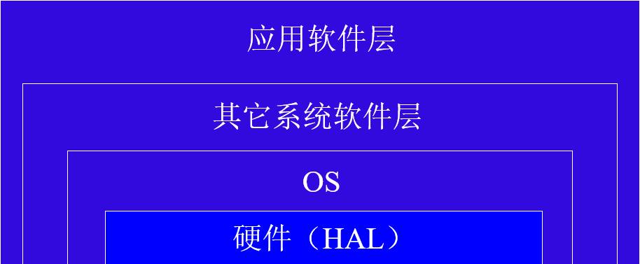
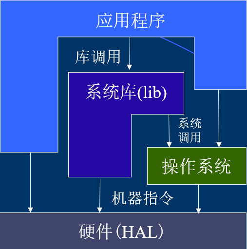

# 操作系统概述

- [操作系统概述](#%e6%93%8d%e4%bd%9c%e7%b3%bb%e7%bb%9f%e6%a6%82%e8%bf%b0)
  - [操作系统概念](#%e6%93%8d%e4%bd%9c%e7%b3%bb%e7%bb%9f%e6%a6%82%e5%bf%b5)
    - [操作系统定义](#%e6%93%8d%e4%bd%9c%e7%b3%bb%e7%bb%9f%e5%ae%9a%e4%b9%89)
    - [操作系统作用](#%e6%93%8d%e4%bd%9c%e7%b3%bb%e7%bb%9f%e4%bd%9c%e7%94%a8)
    - [操作系统地位](#%e6%93%8d%e4%bd%9c%e7%b3%bb%e7%bb%9f%e5%9c%b0%e4%bd%8d)
  - [操作系统的历史](#%e6%93%8d%e4%bd%9c%e7%b3%bb%e7%bb%9f%e7%9a%84%e5%8e%86%e5%8f%b2)
    - [产生](#%e4%ba%a7%e7%94%9f)
      - [***手工操作阶段***(20世纪40年代)](#%e6%89%8b%e5%b7%a5%e6%93%8d%e4%bd%9c%e9%98%b6%e6%ae%b520%e4%b8%96%e7%ba%aa40%e5%b9%b4%e4%bb%a3)
      - [***批处理阶段***（20世纪50年代）](#%e6%89%b9%e5%a4%84%e7%90%86%e9%98%b6%e6%ae%b520%e4%b8%96%e7%ba%aa50%e5%b9%b4%e4%bb%a3)
        - [**联机批处理**(I/O设备与主机相连)](#%e8%81%94%e6%9c%ba%e6%89%b9%e5%a4%84%e7%90%86io%e8%ae%be%e5%a4%87%e4%b8%8e%e4%b8%bb%e6%9c%ba%e7%9b%b8%e8%bf%9e)
        - [**脱机批处理**(I/O设备与卫星机相连)](#%e8%84%b1%e6%9c%ba%e6%89%b9%e5%a4%84%e7%90%86io%e8%ae%be%e5%a4%87%e4%b8%8e%e5%8d%ab%e6%98%9f%e6%9c%ba%e7%9b%b8%e8%bf%9e)
      - [***执行系统阶段***（Executive System 60年代初）](#%e6%89%a7%e8%a1%8c%e7%b3%bb%e7%bb%9f%e9%98%b6%e6%ae%b5executive-system-60%e5%b9%b4%e4%bb%a3%e5%88%9d)
    - [完善](#%e5%ae%8c%e5%96%84)
      - [***多道批处理系统***( Multi-programming System 60年代初)](#%e5%a4%9a%e9%81%93%e6%89%b9%e5%a4%84%e7%90%86%e7%b3%bb%e7%bb%9f-multi-programming-system-60%e5%b9%b4%e4%bb%a3%e5%88%9d)
    - [***分时系统*** (Time-Sharing System 60年代初/中期)](#%e5%88%86%e6%97%b6%e7%b3%bb%e7%bb%9f-time-sharing-system-60%e5%b9%b4%e4%bb%a3%e5%88%9d%e4%b8%ad%e6%9c%9f)

---

## 操作系统概念

### 操作系统定义

- 位于硬件层(HAL)之上、所有其它软件层之下的一个`系统软件`，是管理和控制计算机系统中的`硬件`以及`软件`资源、方便用户使用计算机系统的`程序集合`，能合理组织计算机工作流程，使用户能高效地利用计算机，在用户和计算机之间起到`接口`的作用。

### 操作系统作用

- 管理系统中的软硬件资源
  
  > 从资源管理的观点，OS是计算机系统资源[^1]的管理者，它负责管理和分配系统中的各种硬件和软件资源，以保证系统的各种资源得以有效利用。
  >>OS提供的管理:  
  处理机管理:用于分配和控制处理机。  
  存储器管理：主要负责内存的分配和回收  
  I/O设备管理：负责I/O设备的分配和操纵  
  文件管理：负责文件的存取、共享和保护

[^1]:计算机提供的资源: CPU、内存、设备、文件（本质是信息，指的是数据和程序，以文件形式存在

- 为用户提供良好的界面
  
  > 命令方式、API、GUI[^2]

[^2]:GUI:Graphic User Interface

### 操作系统地位

- 硬件抽象层（HAL）之上，所有其它软件层之下

  
  上图所示的层次关系具有穿透性：<u>高层软件可调用所有低于所在层次的软件,并可与硬件直接打交道</u>
  

- 操作系统是配置在计算机<u>硬件上的第一层软件</u>，是对硬件系统的第一次扩充。 OS在计算机系统中占据着特殊重要的地位，其它<u>所有软件都依赖于它</u>的支持，它是与硬件关系<u>最密切</u>的系统软件

---

## 操作系统的历史

### 操作系统的产生

#### ***手工操作阶段***(20世纪40年代)

> 无操作系统，人在计算机中工作

- 作业处理步骤:
> 1.将程序和数据通过手工操作记录在穿孔纸带上
> 2.将程序纸带放到光电输入机上，再通过控制台开关启
> 3.动光电机将程序输入内存
> 4.通过控制台开关启动程序由第一条指令开始执行
> 5.运行结果在电传打印机上输出。

- 手工操作缺点:
> 1.用户在其作业处理的整个过程中独享系统的全部资源
> 2.手工操作所需时间很长(人机矛盾)

#### ***批处理阶段***（20世纪50年代）

> 缩短手工操作时间，使作业到作业之间的过渡摆脱人的干预, 实现自动化,提高了效率。是**操作系统的雏形**。

##### **联机批处理**(I/O设备与主机相连)

- 工作原理:
  > <u>操作员</u>将<u>若干作业合成一批</u>,将其卡片依次放到<u>读卡机</u>上,监督程序<u>Monitor</u>通过内存将这批作业传送到磁带机上大量作业<u>在磁带机上排队等待处理</u>。<u>输入完毕,监督程序开始处理这一批作业。</u>它自动将第一个作业读入内存,并对其进行汇编(或编译)、连接、执行、输出。第一个作业处理完立即开始处理第二个作业,如此重复,直至所有作业处理完,再处理第二批作业。

  

- 优点:
  > 作业自动转换，大大缩短了手工操作时间
  > 出现了Monitor及相应软件的支持

- 缺点:
  
> 设备的传输速度远低于处理机的速度,I/O设备与CPU直接相连，CPU(主机)浪费(处理机利用monitor程序来处理I/O)

- 改进思想:
  
  > 把输入/输出操作交给一个功能较为单纯的卫星机去做，使主机从繁琐的输入输出操作中解脱出来

##### **脱机批处理**(I/O设备与卫星机相连)

  > 待处理的作业由卫星机负责经读卡机传送到输入磁带上，主机从输入磁带读入作业、加以处理，并把处理结果送到输出磁带上，最后由卫星机负责将输出磁带上的结果在打印机上输出

  

  优点：
  > 卫星机与主机<u>分工明确</u>，**并行**工作，提高了CPU的利用率。

  缺点:
  > 单任务系统；人工拆装磁带。

#### ***执行系统阶段***（Executive System 60年代初）

> 硬件的重要进展：通道、中断技术
> Monitor常驻内存，是OS的**初级阶段**

- 通道(channel):
  
> 也称**I/O处理机**，它<u>具有自己的指令系统和运控部件</u>，可接受处理机的委托执行通道程序，完成I/O操作。通道的I/O操作可与处理机的计算工作**完全并行**，并在<u>I/O操作完成时向处理机发出中断请求</u>。

- 中断(Interrupt):
  
> 中断是指当<u>主机接到某种外部信号</u>(如I/O设备完成信号)时，马上<u>暂停原来的工作，转去处理这一事件，处理完毕再回到原来的断点继续工作</u>。

- 假脱机(Spooling):
  
> 作业由<u>读卡机到存储区的传输</u>以及<u>运行结果由存储区到打印机的传输</u>由**通道完成**，这种方式既**非联机**，也**非脱机**（也不是依靠卫星机），称为“**假脱机**”或“**伪脱机**”。

- 优点:
  
  > 通道取代卫星机，免去了手工装卸磁带的麻烦。

### 操作系统的完善

#### ***多道批处理系统***( Multi-programming System 60年代初)

- 工作流程
  
> 用户提交的作业都先放在<u>外存</u>上并排成一个<u>后备队列</u>，然后由<u>作业调度程序</u>按一定的算法从后备队列中<u>选择若干个作业调入内存</u>。当<u>一道作业因等待I/O传输完成等原因暂时不能运行时，系统可将CPU资源分配给另一个可运行的作业</u>。

- 基本原理
  
> 同时把若干道程序放入内存，并使它们交替的执行。内存中同时存放几道相互独立的程序。

- 特点
  > 1.多道:内存中同时存放几道相互独立的程序
  > 2.宏观并行:多个作业调入内存，同时占有资源各自运行，但都未完成
  > 3.微观串行:轮流占有处理机，交替执行

- 单道和多道比较
  > 在<u>单道批处理</u>中，当作业完成，而下一个作业还没被调入内存时，CPU空闲。
  > 在<u>多道批处理</u>，充分利用了CPU。本质上是同时把若干道程序放入内存，并使它们交替的执行。这样始终使CPU处于忙状态，要比单道批处理复杂的多。

- 优点
  
>  资源利用率高；系统吞叶量(单位时间完成作业量)大

- 缺点
  
  > 作业的平均周转时间长；无交互能力

### ***分时系统*** (Time-Sharing System 60年代初/中期)

