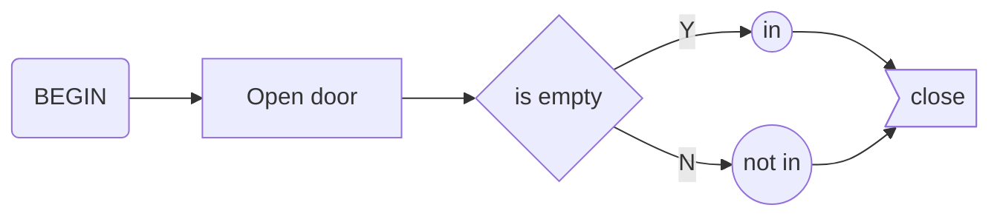
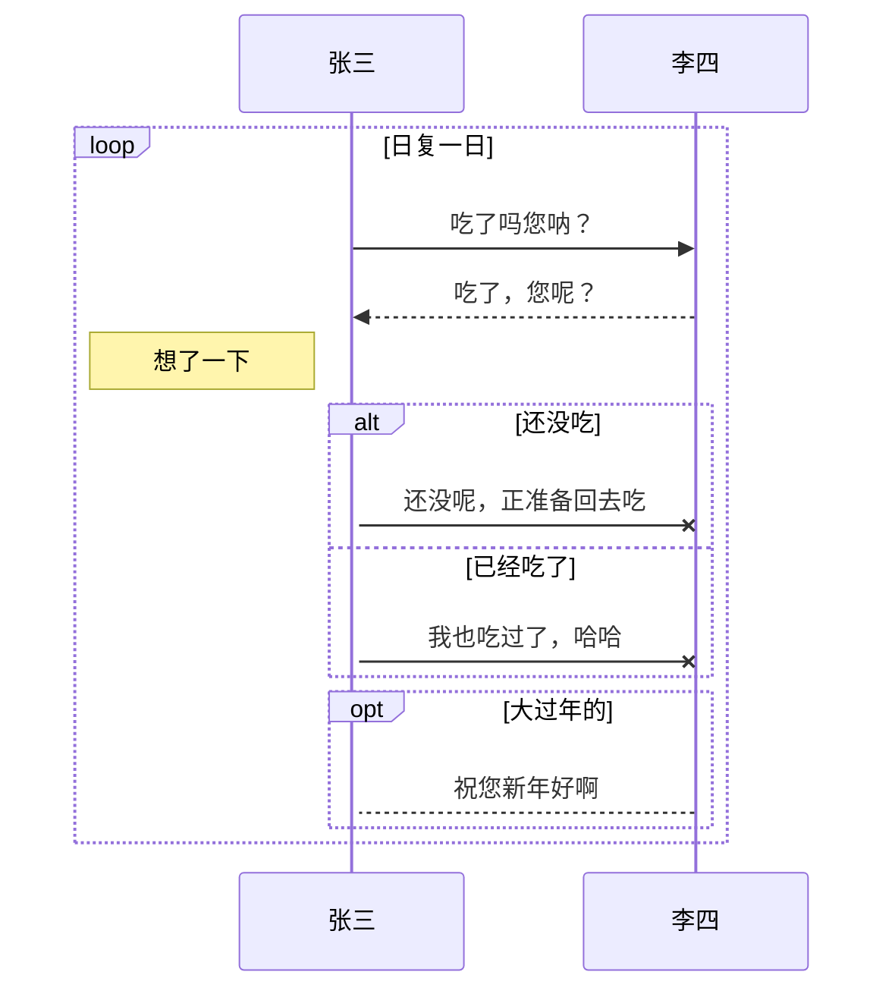
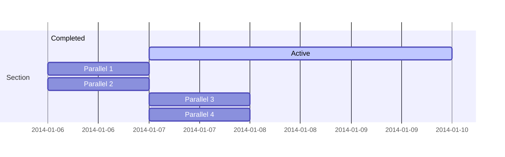
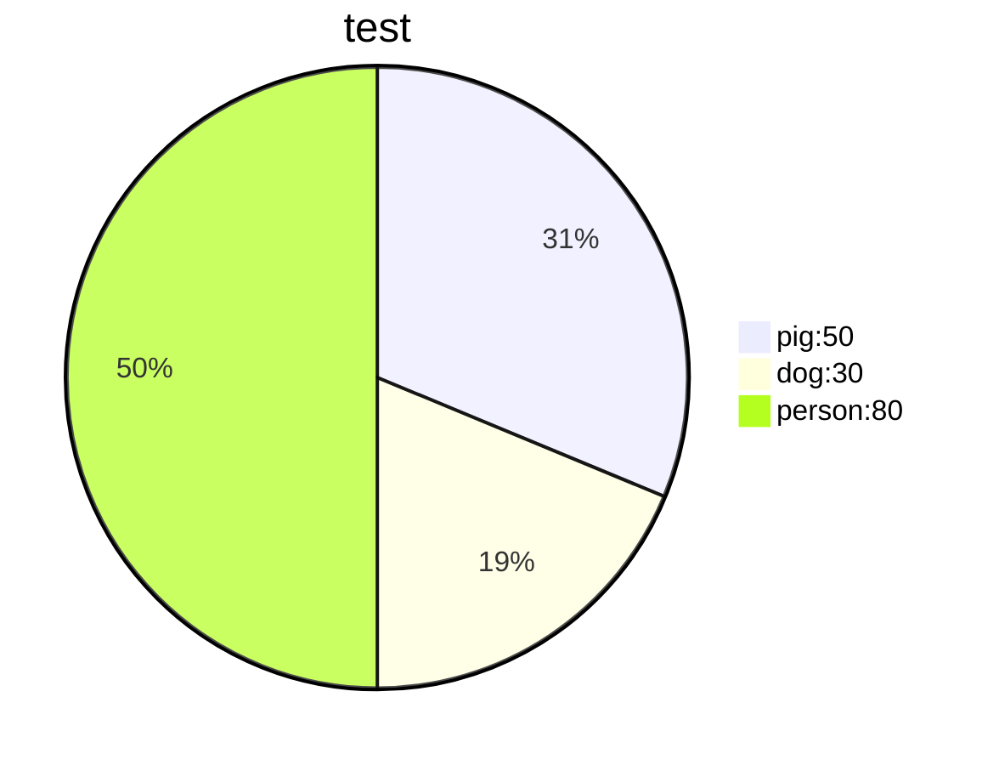
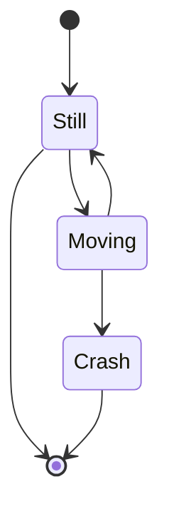

```mermaid
classDiagram
Class01 <|-- AveryLongClass : Cool
<<interface>> Class01
Class09 --> C2 : Where am i?
Class09 --* C3
C3:https://www.baidu.com
<<guess>> Class09
Class09 --|> Class07
Class07 : equals()
Class07 : Object[] elementData
Class01 : size()
Class01 : int chimp
Class01 : int gorilla
class Class10 {
  <<service>>
  int id
  size()
}
```

```flow
st=>start: Start:>http://www.google.com[blank]
e=>end:>http://www.google.com
op1=>operation: My Operation
sub1=>subroutine: My Subroutine:>../操作系统/第一章/第一章.md
cond=>condition: Yes:>http://www.baidu.com
or No?:>http://www.google.com
io=>inputoutput: catch something...
para=>parallel: parallel tasks

st->op1->cond
cond(yes)->io->e
cond(no)->para
para(path1, bottom)->sub1(right)->op1
para(path2, top)->op1
para(path3, right)->io
```









